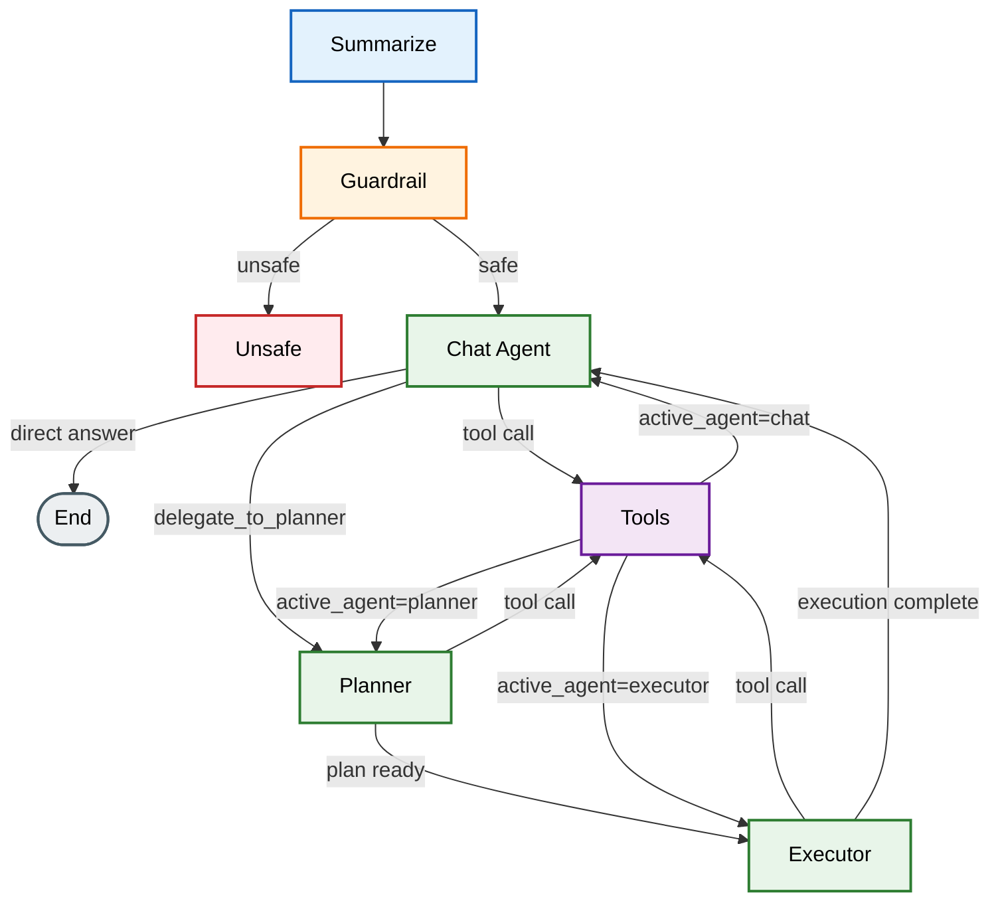

# BizAssist

BizAssist is a full-stack AI business assistant for document Q&A, uploaded-file analysis, and Google Sheets workflows.

It uses a LangGraph-based backend with a lightweight chat-first flow:
- simple conversational and single-step document requests stay in the chat agent
- broader multi-step or external-system work is delegated to a planner + executor path

## What It Does

- Answers grounded questions from chat context, uploaded files, and indexed knowledge-base documents
- Supports chat file uploads for PDF, TXT, and common image formats
- Indexes user documents for semantic retrieval with Qdrant
- Executes Google Sheets read/write operations through tool calling
- Streams assistant output, tool activity, and execution status to the frontend
- Uses interrupt-based clarification when more information is needed
- Supports per-user AI settings, API keys, and guardrail preference

## Current Agent Architecture

The current graph is:



### Node Roles

- `summarize`
  Replaces older checkpoint messages with a rolling summary block so graph state stays compact.

- `guardrail`
  Stops unsafe or out-of-scope requests before the main agent runs.

- `chat`
  Primary entry point. Handles:
  - normal conversation
  - uploaded chat-file inspection
  - single-step knowledge-base retrieval
  - delegation to planning when the task is broader or needs external execution

- `planner`
  Creates a compact structured execution plan for multi-step tasks. It has tool access for clarification, chat-file inspection, document discovery, retrieval, and capability search. Planner loops are capped and adjacent duplicate steps are deduplicated.

- `executor`
  Runs the plan with only the execution brief, plan, steps, and its own tool scratchpad. It does not reread the full chat history.

- `tools`
  Central tool execution node shared by chat, planner, and executor.

## Tooling Model

BizAssist intentionally avoids binding every available tool to every model invocation. Instead, tools are discovered and loaded on demand, reducing context size, token cost, and tool-selection overhead while improving scalability as the tool catalog grows.

### Chat-local tools

The chat agent gets a small direct toolset:
- `request_clarification`
- `list_documents`
- `chat_read_attachment_text`
- `rag_retrieve`
- `delegate_to_planner`

This lets the chat agent solve:
- greetings and normal conversation
- "what files do I have?"
- "answer this from the uploaded document"
- "answer this from the knowledge base"

without waking the planner/executor path.

### Planner / executor tools

The planner and executor use the same registry-backed tool architecture:
- tools are registered once in the tool registry
- only metadata is searched
- only selected tools are loaded for execution
- the executor can ask for more tools at runtime with `search_available_tools`

### Persistent tool catalog

Tool search is backed by a persistent Qdrant collection:
- collection name defaults to `tool_catalog`
- each tool is stored as one indexed document
- metadata embeddings are generated once and reused
- runtime searches embed only the query

We store tool metadata in the vector store to avoid binding every tool schema on every LLM call, which reduces prompt bloat, token cost, and unnecessary tool-selection noise as the tool surface grows.

To sync the tool catalog after changing tool registrations:

```bash
cd backend
python scripts/reindex_tool_catalog.py
```

The reindex script:
- inserts new tools
- updates changed tools using metadata hashing
- removes stale tool records no longer defined in code

## Document Handling

BizAssist currently has two document paths.

### 1. Chat attachments

Files uploaded directly in chat are stored as chat-scoped extracted text artifacts in:

```text
backend/tmp/chats/{chat_id}
```

The assistant can:
- list uploaded chat documents
- inspect them directly from the chat agent
- resolve attachments by ID or filename

Supported chat upload types:
- PDF
- TXT
- JPEG / PNG / GIF / WEBP

Images are OCR'd through a multimodal LLM call and then stored as extracted text.

### 2. Indexed knowledge-base documents

Documents uploaded to the RAG/document pipeline are:
- text-extracted
- chunked with `RecursiveCharacterTextSplitter`
- embedded with OpenAI embeddings
- stored in Qdrant
- tracked in MongoDB

Current chunk settings come from `backend/app/config.py`:
- `chunk_size=1200`
- `chunk_overlap=120`

Qdrant payload filters are indexed for:
- `user_id`
- `filename`

This keeps retrieval user-scoped and filename-filterable.

## Storage Model

### MongoDB

MongoDB stores:
- chats
- visible message history
- document records
- user settings
- integration state
- LangGraph checkpoints through `MongoDBSaver`

### Qdrant

Qdrant stores:
- user document vectors in `business_docs` by default
- persistent tool catalog vectors in `tool_catalog` by default

Document separation is currently enforced with payload filtering on `user_id`.

## Guardrails

Guardrails exist at two levels:
- backend runtime safety node in the graph
- per-user enable/disable preference stored in user settings

This means guardrails are not only environment-controlled anymore; users can toggle the feature in the app settings and the choice persists.

## Frontend Behavior

The frontend is a React 19 + Vite app using Zustand for state.

Current chat UX includes:
- SSE token streaming
- tool activity pills
- planner/executor status updates
- interrupt bubbles for clarification
- optimistic attachment display on user messages
- markdown rendering with `marked` + `dompurify`

Attachments now appear immediately in the user bubble instead of waiting for the assistant response to complete.

## Tech Stack

### Backend

- FastAPI
- LangChain
- LangGraph
- OpenAI models
- MongoDB
- Qdrant Cloud / Qdrant
- Firebase Admin
- Google Sheets API

### Frontend

- React 19
- Vite
- TypeScript
- Tailwind CSS
- Zustand
- Firebase Web SDK
- `marked`
- `dompurify`

## Setup

### Prerequisites

- Python 3.10+
- Node.js 18+
- MongoDB
- Firebase project credentials
- Google OAuth credentials for Sheets
- Qdrant cluster URL and API key

## Backend Setup

```bash
cd backend
python -m venv venv
venv\Scripts\activate
pip install -r requirements.txt
```

Create `backend/.env`.

For local development, the easiest starting point is:
- check `backend/.env copy` to see the shape of the values used in the project right now
- compare it with `backend/.env.example`
- use `backend/app/config.py` as the source of truth for supported settings and defaults

Recommended local flow:

```bash
cd backend
copy ".env.example" ".env"
```

Then fill in the required secrets and endpoints in `.env`.

Important settings:

```env
MONGODB_URI=mongodb://localhost:27017
DB_NAME=bizassist
PRIMARY_MODEL=gpt-4.1-mini
FAST_MODEL=gpt-4.1-mini
NANO_MODEL=gpt-4.1-nano

FIREBASE_PROJECT_ID=
FIREBASE_CLIENT_EMAIL=
FIREBASE_PRIVATE_KEY=
FIREBASE_PRIVATE_KEY_ID=
FIREBASE_CLIENT_ID=
FIREBASE_CLIENT_X509_CERT_URL=

GOOGLE_OAUTH_CLIENT_ID=
GOOGLE_OAUTH_CLIENT_SECRET=
GOOGLE_OAUTH_REDIRECT_URI=
GOOGLE_OAUTH_TOKEN_ENCRYPTION_KEY=

CHUNK_SIZE=1200
CHUNK_OVERLAP=120
EMBEDDING_MODEL=text-embedding-3-small
EMBEDDING_VECTOR_SIZE=1536
QDRANT_URL=
QDRANT_API_KEY=
QDRANT_PORT=6333
QDRANT_DOCUMENTS_COLLECTION=business_docs
QDRANT_TOOL_CATALOG_COLLECTION=tool_catalog

USE_GUARDRAIL=true
AGENT_RUN_RETRIES=2
PLANNER_MAX_ITERATIONS=4
```

Notes:
- user model API keys are provided in-app through settings
- the backend-level `OPENAI_API_KEY` is mainly useful as a fallback for operations like tool catalog indexing
- `backend/.env copy` is useful as a local reference file, but do not commit real secrets into tracked env files

Run the backend:

```bash
uvicorn app.main:app --reload
```

Optional but recommended after tool metadata changes:

```bash
python scripts/reindex_tool_catalog.py
```

## Frontend Setup

```bash
cd frontend
npm install
```

Create `frontend/.env`:

```env
VITE_API_URL=http://localhost:8000
```

Run the frontend:

```bash
npm run dev
```

Production build:

```bash
npm run build
```

## Key Directories

- `backend/app/agents`
  LangGraph nodes, routing, state, and tool orchestration

- `backend/app/services`
  chat streaming, retrieval, vector services, settings, and integrations

- `backend/app/tools`
  LangChain tools for chat attachments and Google Sheets

- `backend/app/routers`
  API routes for chat, documents, settings, and integrations

- `backend/scripts`
  operational scripts like tool catalog reindexing

- `frontend/src/components`
  chat, documents, settings, and layout UI

- `frontend/src/store`
  Zustand state for chat, auth, settings, and theme

## Current Operational Notes

- Tool metadata search uses Qdrant first and falls back to lexical search if needed
- The planner has an iteration limit to avoid runaway loops
- Executor and raw tool chatter are not meant to remain as permanent visible chat messages after successful completion
- Chat attachments are temporary extracted-text artifacts and are periodically cleaned up

## Repository Status

This README reflects the current application behavior as of July 16, 2026 and replaces the older single-agent / Chroma-era description.
